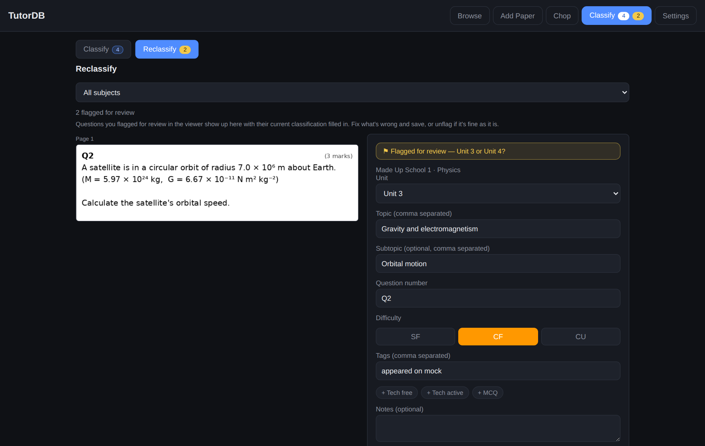
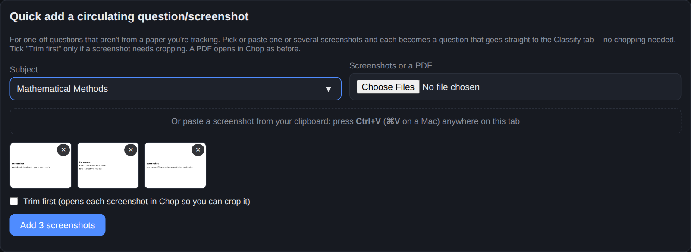
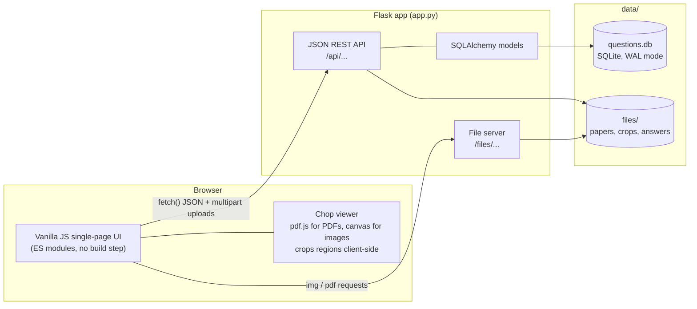
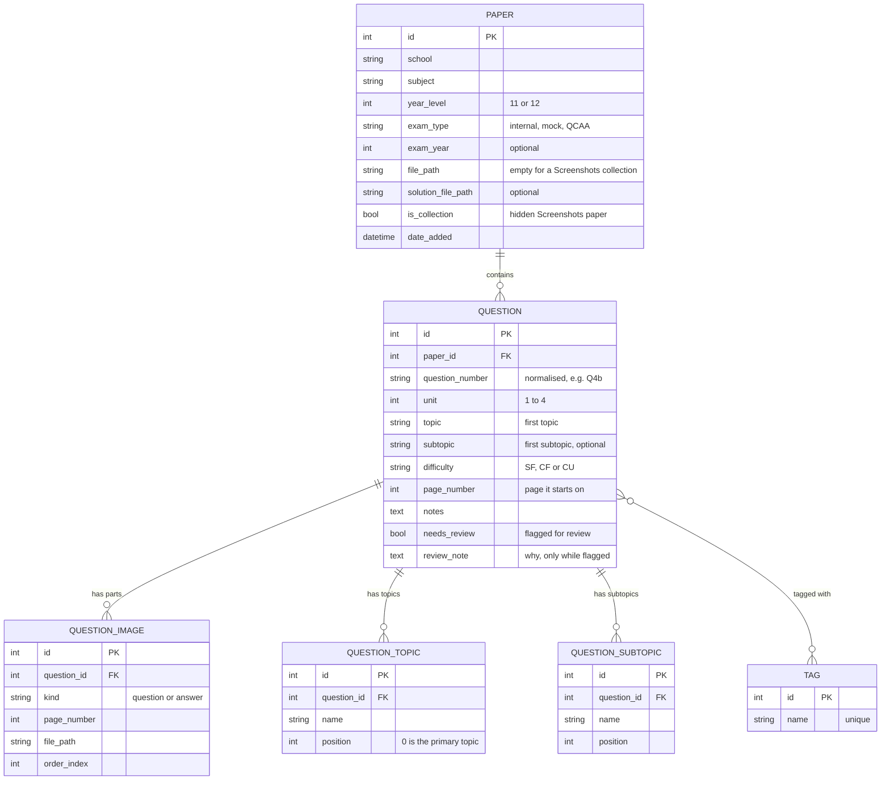

<div align="center">

# TutorDB

**A self-hosted question bank for tutors.**
Add exam papers or screenshots, "chop" them into individual questions, classify each one by unit, topics, difficulty and tags, and then filter the whole bank in seconds when you're planning a lesson.


<sub>Screenshots use the bundled, fully fictional demo data (see <a href="#try-it-with-demo-data">Try it with demo data</a>).</sub>

</div>

---

## Table of contents

- [Why TutorDB?](#why-tutordb)
- [Features](#features)
- [Screenshots](#screenshots)
- [Quick start](#quick-start)
- [Try it with demo data](#try-it-with-demo-data)
- [How to use it](#how-to-use-it)
- [Architecture](#architecture)
- [Data model](#data-model)
- [API](#api)
- [Project structure](#project-structure)
- [Deploying on a small server](#deploying-on-a-small-server-raspberry-pi--odroid-etc)
- [Backups and moving machines](#backups-and-moving-machines)
- [Customising for your curriculum](#customising-for-your-curriculum)
- [Security and privacy notes](#security-and-privacy-notes)
- [Known limitations and roadmap](#known-limitations-and-roadmap)
- [Contributing](#contributing)
- [License and third-party code](#license-and-third-party-code)

## Why TutorDB?

Tutors end up with folders full of past papers, mock exams and screenshots of questions that were sent around by students. Finding "a Complex Familiar question on the binomial distribution from a mock exam" means opening PDFs one by one.

TutorDB turns that pile into a searchable bank:

1. **Add** papers (or just paste in screenshots) and **chop** them into single questions, and optionally their worked solutions.
2. **Classify** each question once: unit, one or more topics and subtopics, difficulty, and free-form tags.
3. **Filter** instantly, then click through the results full-screen with the arrow keys, ready to put in front of a student.

It's a small, dependency-light Flask app that runs happily on a single-board computer, so your question bank lives on hardware you own rather than in someone else's cloud.

## Features

**Building the bank**
- **Visual "chopper"**: render a PDF (via [pdf.js](https://mozilla.github.io/pdf.js/)) or an image in the browser, drag a box around a question, and it's cropped and saved. Works with mouse **and touch**, with zoom, fit-to-width and page navigation.
- **Sharp crops**: a box drawn on a PDF is re-rendered from the PDF itself at about 216 DPI, so the saved image doesn't depend on your zoom level or screen. Screenshots are cropped from their original pixels, 1:1.
- **Multi-page questions**: a question that runs over a page break is just several crops staged together and saved as one question.
- **Worked solutions**: chop them out of a solutions PDF alongside the paper, or attach images/PDFs/Word files to any question later. Solutions stay hidden behind a *Reveal answer* button.
- **Quick Add for screenshots**: pick or **paste** (Ctrl+V) one or several screenshots and each becomes a question that goes straight to the Classify queue. No paper is created per screenshot, and there's no chopping unless you tick **Trim first**.
- **Quick save (classify later)**: chop a whole paper fast without filling in any details, then classify the backlog afterwards.

**Classifying**
- **Several topics and subtopics per question**, typed comma-separated exactly like tags (`Integrals, Discrete random variables`). Click-to-add suggestion chips show what you've already used for that subject and unit, so names stay consistent.
- **Difficulty** (SF / CF / CU), **unit** (1-4), and free-form **tags** with one-click quick-tag buttons.
- **Classify tab**: works through the quick-saved backlog one question at a time, with a subject filter.
- **Flag for review**: spot something wrong while browsing? Flag the question (with an optional note) from the viewer, and fix it later in the **Reclassify** mode of the Classify tab, which opens each flagged question pre-filled. Two coloured counts on the tab show how much is waiting (blue: to classify, amber: to review).

**Finding things**
- **Chip filters**: Subject, School, Paper and Exam type, plus multi-select chips for Unit, Difficulty, Topic and Subtopic that narrow each other.
- **Tag logic**: include tags (must have *all*) and exclude tags (drop a question if it has *any*), e.g. include `appeared on mock`, exclude `circulating`.
- **Any-match topics**: a question with several topics shows up under each of them.
- **Fast at size**: filtering and paging happen in SQL (60 per page with *Load more*), not in the browser.
- **Full-screen viewer**: walk through exactly the filtered set with `←` / `→` (they don't fire while you're typing), close with `Esc`, edit or delete in place.
- **Readable cards**: topics are violet pills, subtopics cyan, tags grey, and unclassified or flagged questions carry a badge.

**Running it**
- **One-click backup**: a single zip with a consistent snapshot of the database plus every file, portable to another machine with no relinking.
- **Runs offline**: pdf.js is vendored, there are no CDNs and there is no build step.
- **Safe upgrades**: schema changes are additive and applied automatically on start-up, and they never rewrite your existing questions.
- **Systemd installer** for always-on hosting on a Linux box.

## Screenshots

| Chop a paper into questions | Full-screen viewer |
|:---:|:---:|
|  |  |
| Draw a box, classify it, save, repeat. Topics and subtopics take comma-separated lists with suggestion chips. | Step through the filtered results, reveal the worked solution, flag anything that looks wrong. |
| **Classify and Reclassify** | **Quick Add screenshots** |
|  |  |
| Flagged questions come back pre-filled, with your note. The blue and amber counts show what's waiting. | Pick or paste screenshots and each becomes a question in the Classify queue. |

## Quick start

**Requirements:** Python 3.10 or newer. Verified with Python 3.12, Flask 3.1 and Flask-SQLAlchemy 3.1.

```bash
# 1. Get the code
git clone https://github.com/spere43/TutorDB.git
cd TutorDB

# 2. Create and activate a virtual environment
python3 -m venv venv
source venv/bin/activate            # Windows (PowerShell): venv\Scripts\Activate.ps1

# 3. Install dependencies
pip install -r requirements.txt

# 4. Run
python app.py
```

Open **http://localhost:5000**. The first start creates a `data/` folder next to `app.py` containing the SQLite database (`data/questions.db`) and all uploaded files (`data/files/`). Nothing else needs configuring.

> The server listens on all network interfaces (`0.0.0.0:5000`), so other devices on your network can reach it at `http://<your-machine's-ip>:5000`. There is no login, so read the [security notes](#security-and-privacy-notes) before doing that on a network you don't trust.

## Try it with demo data

No exam papers to hand? Generate a small **fully fictional** question bank:

```bash
pip install pillow                  # only needed for the demo generator
python scripts/seed_demo.py
python app.py
```

You get:

- **3 papers** with PDFs to practise chopping on, two of them with worked solutions
- **13 classified questions**, including one with several topics and one with several subtopics
- **2 questions flagged for review**, waiting in Classify → Reclassify
- **4 unclassified "screenshot" questions** waiting in the Classify queue

The script writes into `data/`, so it refuses to run if the database already contains papers. To reset the demo, stop the app and delete the `data/` folder.

## How to use it

The app has five tabs.

### 1. Browse

The Unit and Difficulty chips are always available; pick a **Subject** and the Topic and Subtopic chips fill in with what you've used for it (choosing topics narrows the subtopics). Click chips to narrow (several per row are allowed: a question matches if it has *any* of the selected topics, for example), add include/exclude tags, then press **Filter**. Results load 60 at a time.

Choose a specific **Paper** and the questions load in that paper's order, grouped by the `Tech free` / `Tech active` tags (see [customising](#customising-for-your-curriculum)).

Open **Details** on any card for the full-screen viewer: `←` / `→` step through the current results, `Esc` closes, and you can reveal or add worked solutions, **Edit** the classification, **Flag** the question, or delete it.

### 2. Add Paper

Upload a paper (PDF, plus an optional solutions file) with its school, subject, year level (11 or 12), exam type (internal / mock / QCAA-style) and optionally the year. The tab also lists your papers grouped by subject, lets you fix their metadata, and hosts **Quick Add**.

**Quick Add** is for one-off questions that aren't from a paper you're tracking, such as a screenshot someone sent you:

1. Enter the subject, then **pick** one or several PNG/JPG files, or **paste** a screenshot with `Ctrl+V` (`⌘V` on a Mac) anywhere on the tab. Each appears as a thumbnail you can remove with ×.
2. Press **Add**. Each screenshot becomes an unclassified question and lands in the Classify queue. All of a subject's screenshots share one hidden "Screenshots" paper, so nothing clutters the paper list.
3. Only if a screenshot needs cropping, tick **Trim first**. Chop opens each one in turn (*Screenshot 1 / 3*, with Prev / Next / Finish) and only the crops you save are stored. The untrimmed originals never leave your device.

A single **PDF** in Quick Add still creates a paper and opens it in Chop.

Papers made by older versions of Quick Add (school `Uncategorized`, type `misc`) are grouped into one **Random screenshots** row per subject, in both Add Paper and the Chop picker. It opens into a gallery where each thumbnail shows how many questions it has. **Select ones with no questions** followed by **Delete selected** is a safe way to clear out leftovers, and deleting screenshots that do have questions asks first.

### 3. Chop

Pick a paper and it opens in the browser (PDF or image).

1. **Draw a box** around a question. A cropped preview appears in the side panel.
2. If the question continues on the next page, go there, draw another box and press **+ Add another page/part**.
3. Fill in the question number (`4b`, `q4b` and `Q4b` all become `Q4b`), **unit**, **topics**, optional **subtopics**, **difficulty** and any tags. Topics and subtopics take comma-separated lists, with chips suggesting what you've used before for that subject and unit.
4. **Save question** (the form resets for the next one), or **Quick save (classify later)** to store just the crop and classify it afterwards.

If the paper has a solutions file, a **Chop Answers** mode appears: draw a box around a worked solution and link it to the question it answers.

### 4. Classify

Two modes, switched at the top. The tab shows a blue count for **Classify** and an amber count for **Reclassify** (they read `99+` and `9+` past a cap; hover for the exact number).

- **Classify** is the queue of questions you quick-saved or added as screenshots. Each shows its image beside a form; fill in the unit, topics and difficulty, then **Save & next**. **Skip for now** sends one to the back of the queue.
- **Reclassify** is the queue of questions you flagged. The form opens **pre-filled** with the current classification and your flag note. **Save & clear flag** saves your changes and unflags the question, and **Looks fine — unflag** clears the flag without touching anything else.

### 5. Settings

Currently home to the one-click [backup](#backups-and-moving-machines).

### Flagging a question for review

While browsing, open a question in the viewer and press **⚑ Flag**. A box asks *Why?* (optional, e.g. "difficulty looks wrong"); Enter confirms. The card gets a "⚑ review" badge, the viewer shows your note, and the question joins the Reclassify queue. **⚑ Unflag** in the viewer, or the **Unflag** button inside the Edit form, clears it. Ordinary edits never clear a flag by accident.

### Difficulty levels

Difficulty uses the three-level scale common in Queensland senior maths and science assessment:

| Code | Meaning |
|:---:|---|
| **SF** | Simple Familiar |
| **CF** | Complex Familiar |
| **CU** | Complex Unfamiliar |

## Architecture



**Design decisions worth knowing about**

- **Cropping happens client-side.** The page is drawn to a canvas and the selection is uploaded as a PNG, so the server never has to parse a PDF, which keeps it light enough for a low-power device.
- **PDF crops are re-rendered, not screenshotted.** When you release the mouse, only the selected region is rendered again straight from the PDF at a fixed scale (about 216 DPI). Copying pixels off the screen would make the result depend on your zoom and monitor.
- **Images look like one-page documents.** A small adapter gives an `` the same interface pdf.js gives a page (page count, viewport, render), so the viewer, zoom, box drawing and cropping code is shared. Screenshot crops are cut from the image's own pixels rather than re-rendered.
- **Images live in their own table.** Rather than one file column per question, `question_images` holds any number of ordered parts of kind `question` or `answer`. Multi-page questions and multi-page solutions fall out naturally.
- **Several topics without touching old data.** Topic and subtopic lists live in `question_topics` / `question_subtopics`, while the original `topic` and `subtopic` columns stay and hold the *first* entry. Every older question keeps working exactly as it was, and an older version of the app can still read the database.
- **Additive, idempotent migrations.** There's no Alembic. On start-up the app adds missing columns (with defaults), creates new tables, copies existing values into them and normalises data. Every step is safe to re-run and none of them rewrites an existing question.
- **Screenshots share a hidden paper.** A subject's screenshots hang off one auto-created collection paper (`is_collection`), instead of each one creating a paper of its own.
- **Server-side filtering.** Filters, tag include/exclude and paging are SQL (`EXISTS` clauses with indexes), so the cost doesn't grow with the size of the bank.
- **Portable file paths.** Every stored path is relative to `data/files/`, so moving the bank to another machine is just copying the folder.
- **Safe backups.** The backup endpoint uses SQLite's online backup API instead of copying the `.db` file, so a write landing mid-backup can't produce a torn snapshot. The zip is built on disk rather than in memory because the target hardware has little RAM.
- **Unit lives on the question, not the paper.** A single paper can legitimately mix content from several units, so unit is chosen per question and topic lists are scoped to *subject + unit*.

## Data model



A question with no topic and difficulty yet (`""`) is *unclassified*, which is what the Classify queue is built from. Deleting a paper cascades to its questions and their rows in the database (the uploaded files themselves are left on disk).

## API

TutorDB is API-first: the UI is just a client of the JSON endpoints, so you can script against it. A few examples:

```bash
# Complex Familiar, Unit 3 Methods questions that appeared on a mock but aren't "circulating"
curl "http://localhost:5000/api/questions?subject=Mathematical%20Methods&unit=3&difficulty=CF&tag=appeared%20on%20mock&exclude_tag=circulating"
# -> { "questions": [ ... ], "total": 1, "page": 1, "per_page": 60, "has_more": false }

# Add screenshots straight into the Classify queue
curl -X POST http://localhost:5000/api/screenshots -F subject=Physics -F file=@snip1.png -F file=@snip2.png

# What the Classify tab's badges show
curl http://localhost:5000/api/classify-counts
# -> { "needs_review": 2, "unclassified": 4 }
```

| Area | Endpoints |
|---|---|
| Papers | `GET/POST /api/papers`, `POST /api/papers/quick`, `POST /api/papers/collection`, `PATCH/DELETE /api/papers/<id>` |
| Screenshots | `POST /api/screenshots` |
| Questions | `GET/POST /api/questions`, `POST /api/questions/quick`, `GET/PATCH/DELETE /api/questions/<id>` |
| Question parts | `POST /api/questions/<id>/crop`, `POST/DELETE /api/questions/<id>/answer`, `DELETE /api/questions/<id>/images/<image_id>` |
| Classify | `GET /api/classify-counts` |
| Lookups | `GET /api/tags`, `/api/topics`, `/api/subtopics`, `/api/subjects`, `/api/schools` |
| Ops | `GET /api/status`, `GET /api/backup`, `GET /files/<path>` |

Full request/response details are in **[docs/API.md](docs/API.md)**.

## Project structure

```
TutorDB/
├── app.py                  # Flask app: models, REST API, file serving, start-up migrations
├── requirements.txt        # Flask, Flask-SQLAlchemy
├── install_service.sh      # Installs TutorDB as a systemd service (Linux)
├── templates/
│   └── index.html          # Single page: Browse / Add Paper / Chop / Classify / Settings + viewer modal
├── static/
│   ├── css/style.css       # Dark theme, responsive layout
│   ├── js/app.js           # All client logic (ES module)
│   └── vendor/pdfjs/       # Vendored pdf.js (Apache-2.0)
├── scripts/
│   └── seed_demo.py        # Generates a fictional demo dataset
├── docs/
│   ├── API.md              # Endpoint reference
│   └── screenshots/        # Images used in this README
├── data/                   # Created at runtime; git-ignored (database + uploaded files)
├── CONTRIBUTING.md
├── LICENSE
└── THIRD_PARTY_NOTICES.md
```

## Deploying on a small server (Raspberry Pi / ODROID etc.)

TutorDB was built to run on a low-power single-board computer. To have it start on boot and restart if it crashes, use the bundled installer **on the target machine**:

```bash
git clone https://github.com/spere43/TutorDB.git && cd TutorDB
python3 -m venv venv && source venv/bin/activate
pip install -r requirements.txt

chmod +x install_service.sh
./install_service.sh
```

The script writes `/etc/systemd/system/tutordb.service` (running as your user, from the project folder, with `Restart=always`), then enables and starts it. It uses whichever `python3` is first on your `PATH`, so run it with your virtual environment **activated** so the service picks up the installed dependencies.

```bash
sudo systemctl status tutordb      # is it running?
journalctl -u tutordb -f           # live logs
sudo systemctl restart tutordb     # after pulling new code
sudo systemctl stop tutordb
```

After pulling an update, restart the service and hard-refresh the browser (`Ctrl+F5`) so it picks up the new front-end files. Any needed database changes are applied automatically on start-up, but take a [backup](#backups-and-moving-machines) first, as you would before any upgrade.

For anything beyond a home/office network, see the [security notes](#security-and-privacy-notes) first.

## Backups and moving machines

**Settings → Download backup** (or `GET /api/backup`) streams one zip containing:

```
questions.db      # consistent snapshot of the database
files/...         # every paper, crop and solution, same layout as data/files/
```

To restore on another machine: stop the app, extract the zip into that machine's `data/` folder (replacing what's there), start the app. No relinking is needed because stored paths are relative.

## Customising for your curriculum

TutorDB currently assumes the Queensland (QCE) setup it was built for. To adapt it, these are the places to change:

| What | Where |
|---|---|
| Difficulty codes (`SF`/`CF`/`CU`) | `app.py` (validation in `create_question` / `update_question`), `DIFFICULTY_OPTIONS` and the `.diff-btn` buttons in `static/js/app.js` and `templates/index.html`, badge colours in `static/css/style.css` |
| Units 1-4 | Validation in `app.py`, the unit `<select>`s in `index.html`, and `UNIT_OPTIONS` plus the edit and classify forms in `app.js` |
| Year levels 11/12 | `index.html` (`#p-year-level`) |
| Exam types | `index.html` (`#p-exam-type`, `#f-exam-type`) |
| Quick-tag buttons (`Tech free`, `Tech active`, `MCQ`) | `QUICK_TAGS` in `app.js` |
| Tags that order a single paper's questions | `paperClassSortKey` in `app.js` (`Tech free`, then `Tech active`) |
| Classify tab count caps (`99+`, `9+`) | `CLASSIFY_BADGE_CAP`, `REVIEW_BADGE_CAP` in `app.js` |
| PDF crop sharpness | `CROP_EXPORT_SCALE` in `app.js` (default 3, about 216 DPI; lower it for smaller files) |
| Results per page | `BROWSE_PAGE_SIZE` in `app.js` |
| Host and port | Last line of `app.py` |
| Allowed upload types | `ALLOWED_EXTENSIONS` and `IMAGE_EXTENSIONS` at the top of `app.py` |

Subjects, schools, topics, subtopics and tags need no changes: they're free text and build themselves from what you enter.

## Security and privacy notes

TutorDB is designed as a **personal / small-team tool on a trusted network**, not an internet-facing service.

- **There is no authentication.** Anyone who can reach the port can view, edit, delete and download everything. Keep it on your LAN or a VPN (e.g. Tailscale or WireGuard), or put it behind a reverse proxy that adds authentication.
- **It runs Flask's built-in server with debug mode off** (`debug=False`), bound to `0.0.0.0`. That's fine for home use behind the points above, but Flask prints a development-server warning for a reason: for anything more, serve it with a production WSGI server (e.g. `gunicorn`) behind a reverse proxy.
- **Uploads** are restricted to `pdf, doc, docx, png, jpg, jpeg` (screenshots to `png, jpg, jpeg`), sanitised with `secure_filename`, and stored under a random UUID prefix. No maximum upload size is configured; set `MAX_CONTENT_LENGTH` if you need one.
- **Your papers never enter the repository.** `data/` is git-ignored. Please keep it that way: exam papers are usually copyrighted, and you're responsible for having the right to store and use whatever you upload.
- The included demo data is original and fictional.

## Known limitations and roadmap

Honest current state, in rough priority order:

- [ ] **Deleting doesn't remove files.** Deleting a paper or question removes its database rows but leaves the uploaded files in `data/files/`.
- [ ] **Configuration via environment variables** (host, port, data directory) instead of editing `app.py`.
- [ ] **Authentication** (even a single shared password) for use beyond a trusted network.
- [ ] **Automated tests** (`pytest` + Flask test client) covering the filters, tag rules and the start-up migrations. Changes are currently verified by hand and by comparing API output before and after on a copy of a real database.
- [ ] **Proper migrations** with Alembic in place of the hand-written start-up steps.
- [ ] **Pair subtopics with topics.** They're independent lists (like tags), so a question with topics A and B and subtopics x and y offers x and y under both.
- [ ] **Word files can be stored but not chopped**, and screenshots must be PNG or JPG (no HEIC or WebP yet). Convert to PDF or PNG first.
- [ ] **Screenshot gallery thumbnails** are the full-size images (loaded lazily). Generating small thumbnails would keep large galleries light.
- [ ] **Trim sessions live in the browser.** Reloading mid-way means re-picking the remaining screenshots.
- [ ] **Pasting on iPad / iPhone** is untested; the file picker there can multi-select from Photos.
- [ ] **Modernise deprecated calls** (`datetime.utcnow()`, legacy `Query.get()`).
- [ ] **Dockerfile / docker-compose** for one-command setup.
- [ ] **Worksheet export**: build a printable PDF from a filtered set of questions.

Ideas and pull requests are welcome.

## Contributing

Bug reports, ideas and PRs are welcome. See **[CONTRIBUTING.md](CONTRIBUTING.md)** for how to get set up and what makes a good change.

## License and third-party code

TutorDB is released under the **[MIT License](LICENSE)**.

It bundles [**pdf.js**](https://github.com/mozilla/pdf.js) v4.0.379 by the Mozilla Foundation (`static/vendor/pdfjs/`), distributed under the [Apache License 2.0](https://www.apache.org/licenses/LICENSE-2.0). The full notice is in **[THIRD_PARTY_NOTICES.md](THIRD_PARTY_NOTICES.md)**, and each file keeps its original license header.
