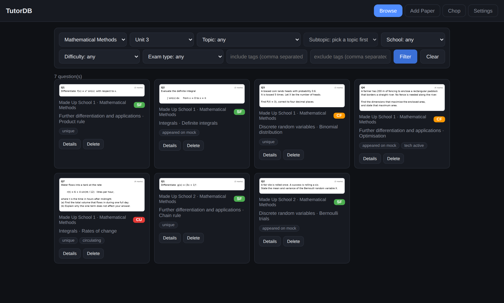
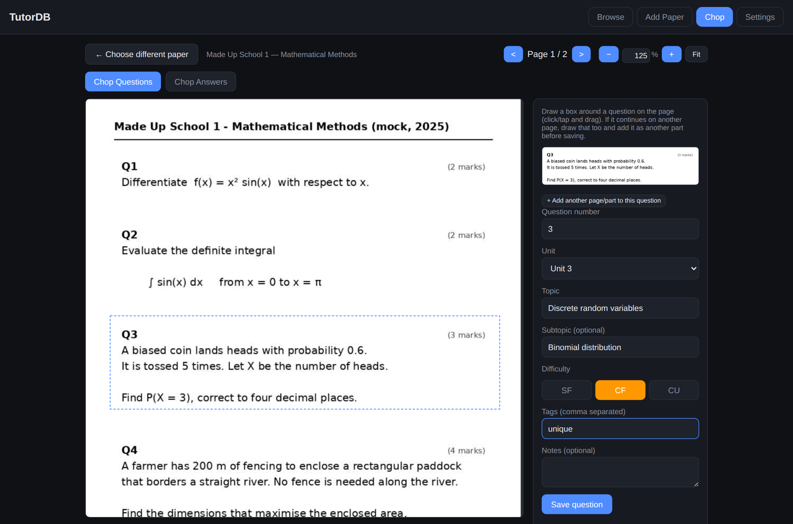
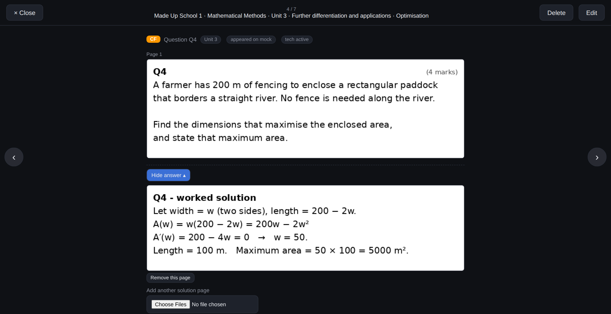
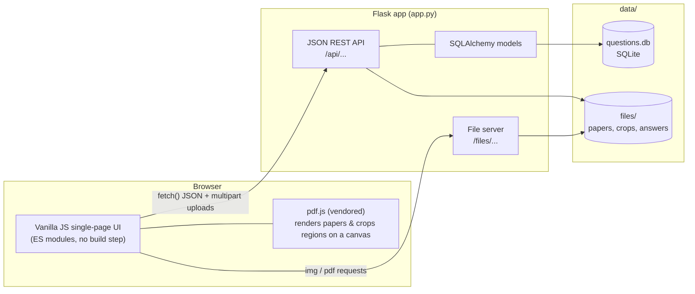
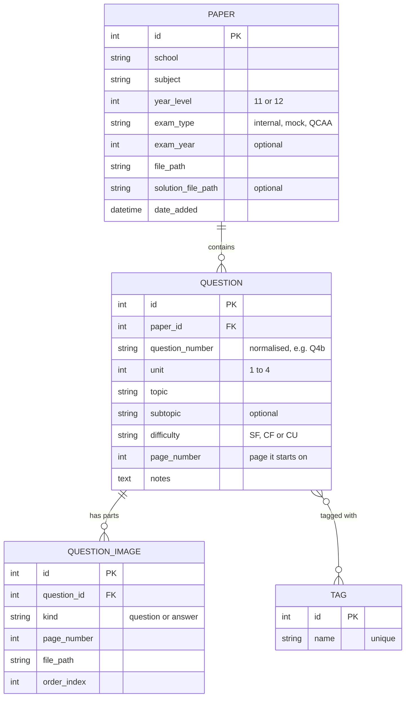

<div align="center">

# TutorDB

**A self-hosted question bank for tutors.**
Upload exam papers, "chop" them into individual questions with a click-and-drag box, tag each one by unit, topic and difficulty, and then filter the whole bank in seconds when you're planning a lesson.




<sub>Screenshots use the bundled, fully fictional demo data (see <a href="#try-it-with-demo-data">Try it with demo data</a>).</sub>

</div>

---

## Table of contents

- [Why TutorDB?](#why-tutordb)
- [Features](#features)
- [Screenshots](#screenshots)
- [Quick start](#quick-start)
- [Try it with demo data](#try-it-with-demo-data)
- [How to use it](#how-to-use-it)
- [Architecture](#architecture)
- [Data model](#data-model)
- [API](#api)
- [Project structure](#project-structure)
- [Deploying on a small server](#deploying-on-a-small-server-raspberry-pi--odroid-etc)
- [Backups and moving machines](#backups-and-moving-machines)
- [Customising for your curriculum](#customising-for-your-curriculum)
- [Security and privacy notes](#security-and-privacy-notes)
- [Known limitations and roadmap](#known-limitations-and-roadmap)
- [Contributing](#contributing)
- [License and third-party code](#license-and-third-party-code)

## Why TutorDB?

Tutors end up with folders full of past papers, mock exams and screenshots of questions that were sent around by students. Finding "a Complex Familiar question on the binomial distribution from a mock exam" means opening PDFs one by one.

TutorDB turns that pile into a searchable bank:

1. **Chop** each paper into single questions (and, optionally, their worked solutions).
2. **Tag** them once with unit, topic, subtopic, difficulty and free-form tags.
3. **Filter** instantly, then click through the results full-screen with the arrow keys, ready to put in front of a student.

It's a small, dependency-light Flask app that runs happily on a single-board computer, so your question bank lives on hardware you own rather than in someone else's cloud.

## Features

**Building the bank**
- **Visual "chopper"**: render any PDF in the browser (via [pdf.js](https://mozilla.github.io/pdf.js/)), drag a box around a question, and it's cropped to an image and saved. Works with mouse **and touch**, with zoom, fit-to-width and page navigation.
- **Multi-page questions**: a question that runs over a page break is just several crops staged together and saved as one question.
- **Worked solutions**: chop them out of a solutions PDF alongside the paper, or attach images/PDFs/Word files to any question later. Solutions stay hidden behind a *Reveal answer* button.
- **Quick add**: a one-off question that isn't part of a tracked paper can be added without filling in school / year / exam-type details (see the [PDF limitation](#known-limitations-and-roadmap)).
- **Smart forms**: unit, topic and subtopic dropdowns are cascading and autocomplete from what's already in your bank, so tags stay consistent as it grows.

**Finding things**
- **Cascading filters**: subject → unit → topic → subtopic, plus school, difficulty, exam type.
- **Tag logic**: include tags (must have *all*) and exclude tags (drop a question if it has *any*), e.g. `include: appeared on mock`, `exclude: circulating`.
- **Full-screen viewer**: walk through exactly the filtered set with `←` / `→`, close with `Esc`.
- **Edit in place**: fix a unit, topic, difficulty or tag without re-uploading anything.

**Running it**
- **One-click backup**: a single zip with a consistent snapshot of the database plus every file, portable to another machine with no relinking.
- **Runs offline**: pdf.js is vendored, there are no CDNs and there is no build step.
- **Systemd installer** for always-on hosting on a Linux box.

## Screenshots

| Chop a paper into questions | Full-screen viewer with worked solution |
|:---:|:---:|
|  |  |
| Draw a box, tag it, save, repeat. | Step through filtered results; reveal the solution when ready. |

## Quick start

**Requirements:** Python 3.10 or newer. Verified with Python 3.12, Flask 3.1 and Flask-SQLAlchemy 3.1.

```bash
# 1. Get the code
git clone https://github.com/spere43/TutorDB.git
cd TutorDB

# 2. Create and activate a virtual environment
python3 -m venv venv
source venv/bin/activate            # Windows (PowerShell): venv\Scripts\Activate.ps1

# 3. Install dependencies
pip install -r requirements.txt

# 4. Run
python app.py
```

Open **http://localhost:5000**. The first start creates a `data/` folder next to `app.py` containing the SQLite database (`data/questions.db`) and all uploaded files (`data/files/`). Nothing else needs configuring.

> The server listens on all network interfaces (`0.0.0.0:5000`), so other devices on your network can reach it at `http://<your-machine's-ip>:5000`. Read the [security notes](#security-and-privacy-notes) before doing that on a network you don't trust.

## Try it with demo data

No exam papers to hand? Generate a small **fully fictional** question bank (3 papers, 13 questions, worked solutions, and PDFs you can practise chopping on):

```bash
pip install pillow                  # only needed for the demo generator
python scripts/seed_demo.py
python app.py
```

The script writes into `data/`, so it refuses to run if the database already contains papers. To reset the demo, stop the app and delete the `data/` folder.

## How to use it

The app has four tabs.

### 1. Add Paper

Upload a paper (PDF, plus an optional solutions PDF) with its school, subject, year level (11 or 12), exam type (internal / mock / QCAA-style) and optionally the year. The same tab lists your papers grouped by subject, lets you fix their metadata, and includes **Quick add** for one-off questions.

### 2. Chop

Pick a paper and the PDF opens in the browser.

1. **Draw a box** around a question. A cropped preview appears in the side panel.
2. If the question continues on the next page, go there, draw another box and press **+ Add another page/part**.
3. Fill in the question number (`4b`, `q4b` and `Q4b` all become `Q4b`), **unit**, **topic**, optional subtopic, **difficulty** and any tags.
4. **Save.** The form resets and you're ready for the next question.

If the paper has a solutions file, a **Chop Answers** mode appears: draw a box around a worked solution and link it to the question it answers.

### 3. Browse

Use the filter bar to narrow the bank, then open **Details** on any card for the full-screen viewer. From there you can reveal or add worked solutions, edit a question's metadata, or delete it.

### 4. Settings

Currently home to the one-click [backup](#backups-and-moving-machines).

### Difficulty levels

Difficulty uses the three-level scale common in Queensland senior maths and science assessment:

| Code | Meaning |
|:---:|---|
| **SF** | Simple Familiar |
| **CF** | Complex Familiar |
| **CU** | Complex Unfamiliar |

## Architecture



**Design decisions worth knowing about**

- **Cropping happens client-side.** pdf.js renders the page to a canvas, the selection is copied onto a second canvas, and the resulting PNG is uploaded. The server never has to parse a PDF, which keeps it light enough for a low-power device.
- **Images live in their own table.** Rather than one file column per question, `question_images` holds any number of ordered parts of kind `question` or `answer`. Multi-page questions and multi-page solutions fall out naturally without a special case.
- **Portable file paths.** Every stored path is relative to `data/files/`, so moving the bank to another machine is just copying the folder.
- **Safe backups.** The backup endpoint uses SQLite's online backup API instead of copying the `.db` file, so a write landing mid-backup can't produce a torn snapshot. The zip is built on disk rather than in memory because the target hardware has little RAM.
- **Lightweight migrations.** There's no Alembic; on start-up the app inspects the schema, adds missing columns, migrates older single-image rows into `question_images`, and normalises question numbers. Every step is idempotent.
- **Unit lives on the question, not the paper.** A single paper can legitimately mix content from several units (especially across syllabus changes), so unit is chosen per question and topic lists are scoped to *subject + unit*.

## Data model



Deleting a paper cascades to its questions and their image rows in the database (the uploaded files themselves are left on disk).

## API

TutorDB is API-first: the UI is just a client of the JSON endpoints, so you can script against it. A few examples:

```bash
# Complex Familiar, Unit 3 Methods questions that appeared on a mock but aren't "circulating"
curl "http://localhost:5000/api/questions?subject=Mathematical%20Methods&unit=3&difficulty=CF&tag=appeared%20on%20mock&exclude_tag=circulating"

# Cascading dropdown data
curl "http://localhost:5000/api/topics?subject=Physics&unit=3"

# Health check with counts
curl http://localhost:5000/api/status
```

| Area | Endpoints |
|---|---|
| Papers | `GET/POST /api/papers`, `POST /api/papers/quick`, `PATCH/DELETE /api/papers/<id>` |
| Questions | `GET/POST /api/questions`, `GET/PATCH/DELETE /api/questions/<id>` |
| Question parts | `POST /api/questions/<id>/crop`, `POST/DELETE /api/questions/<id>/answer`, `DELETE /api/questions/<id>/images/<image_id>` |
| Lookups | `GET /api/tags`, `/api/topics`, `/api/subtopics`, `/api/subjects`, `/api/schools` |
| Ops | `GET /api/status`, `GET /api/backup`, `GET /files/<path>` |

Full request/response details are in **[docs/API.md](docs/API.md)**.

## Project structure

```
TutorDB/
├── app.py                  # Flask app: models, REST API, file serving, start-up migrations
├── requirements.txt        # Flask, Flask-SQLAlchemy
├── install_service.sh      # Installs TutorDB as a systemd service (Linux)
├── templates/
│   └── index.html          # Single page: Browse / Add Paper / Chop / Settings + viewer modal
├── static/
│   ├── css/style.css       # Dark theme, responsive layout
│   ├── js/app.js           # All client logic (ES module)
│   └── vendor/pdfjs/       # Vendored pdf.js (Apache-2.0)
├── scripts/
│   └── seed_demo.py        # Generates a fictional demo dataset
├── docs/
│   ├── API.md              # Endpoint reference
│   └── screenshots/        # Images used in this README
├── data/                   # Created at runtime; git-ignored (database + uploaded files)
├── CONTRIBUTING.md
└── LICENSE
```

## Deploying on a small server (Raspberry Pi / ODROID etc.)

TutorDB was built to run on a low-power single-board computer. To have it start on boot and restart if it crashes, use the bundled installer **on the target machine**:

```bash
git clone https://github.com/spere43/TutorDB.git && cd TutorDB
python3 -m venv venv && source venv/bin/activate
pip install -r requirements.txt

chmod +x install_service.sh
./install_service.sh
```

The script writes `/etc/systemd/system/tutordb.service` (running as your user, from the project folder, with `Restart=always`), then enables and starts it. It uses whichever `python3` is first on your `PATH`, so run it with your virtual environment **activated** so the service picks up the installed dependencies.

```bash
sudo systemctl status tutordb      # is it running?
journalctl -u tutordb -f           # live logs
sudo systemctl restart tutordb     # after pulling new code
sudo systemctl stop tutordb
```

For anything beyond a home/office network, see the [security notes](#security-and-privacy-notes) first.

## Backups and moving machines

**Settings → Download backup** (or `GET /api/backup`) streams one zip containing:

```
questions.db      # consistent snapshot of the database
files/...         # every paper, crop and solution, same layout as data/files/
```

To restore on another machine: stop the app, extract the zip into that machine's `data/` folder (replacing what's there), start the app. No relinking is needed because stored paths are relative.

## Customising for your curriculum

TutorDB currently assumes the Queensland (QCE) setup it was built for. To adapt it, these are the places to change:

| What | Where |
|---|---|
| Difficulty codes (`SF`/`CF`/`CU`) | `app.py` (validation in `create_question` / `update_question`), the `f-difficulty` filter and `.diff-btn` buttons in `templates/index.html`, the edit form in `static/js/app.js`, badge colours in `static/css/style.css` |
| Units 1-4 | Validation in `app.py`, the unit `<select>`s in `index.html` and the edit form in `app.js` |
| Year levels 11/12 | `index.html` (`#p-year-level`) |
| Exam types | `index.html` (`#p-exam-type`, `#f-exam-type`) |
| Host, port, debug mode | Last line of `app.py` |
| Allowed upload types | `ALLOWED_EXTENSIONS` at the top of `app.py` |

Subjects, schools, topics, subtopics and tags need no changes: they're free text and build themselves from what you enter.

## Security and privacy notes

TutorDB is designed as a **personal / small-team tool on a trusted network**, not an internet-facing service.

- **There is no authentication.** Anyone who can reach the port can view, edit, delete and download everything. Keep it on your LAN or a VPN (e.g. Tailscale/WireGuard), or put it behind a reverse proxy that adds authentication.
- **Debug mode is on by default** (`app.run(..., debug=True)`) and it binds to `0.0.0.0`. Flask's interactive debugger can execute code, so **never expose this configuration to the internet**. For anything other than local development, set `debug=False` in the last line of `app.py` and serve it with a production WSGI server (e.g. `gunicorn`) behind a reverse proxy.
- **Uploads** are restricted to `pdf, doc, docx, png, jpg, jpeg`, sanitised with `secure_filename`, and stored under a random UUID prefix. No maximum upload size is configured; set `MAX_CONTENT_LENGTH` if you need one.
- **Your papers never enter the repository.** `data/` is git-ignored. Please keep it that way: exam papers are usually copyrighted, and you're responsible for having the right to store and use whatever you upload.
- The included demo data is original and fictional.

## Known limitations and roadmap

Honest current state, in rough priority order:

- [ ] **Chopping needs a PDF.** Images and Word files can be uploaded and viewed, but the Chop workspace uses pdf.js, which only renders PDFs (an image opened there shows a blank canvas). Converting an image to a one-page PDF first works.
- [ ] **Clean up files on delete.** Deleting a paper or question removes its database rows but leaves the uploaded files in `data/files/`.
- [ ] **Configuration via environment variables** (host, port, debug, data directory) instead of editing `app.py`.
- [ ] **Authentication** (even a single shared password) for use beyond a trusted network.
- [ ] **Automated tests** (`pytest` + Flask test client) covering the filter logic, tag include/exclude rules and the migration path.
- [ ] **Proper migrations** with Alembic in place of the hand-written start-up checks.
- [ ] **Server-side pagination and tag filtering.** `GET /api/questions` returns every match and applies tag filters in Python, which is fine for thousands of questions but not for millions.
- [ ] **Modernise deprecated calls** (`datetime.utcnow()`, legacy `Query.get()`).
- [ ] **Dockerfile / docker-compose** for one-command setup.
- [ ] **Worksheet export**: build a printable PDF from a filtered set of questions.
- [ ] In debug mode the auto-reloader can restart the server when a backup zip is written into `data/`; turning debug off avoids this.

Ideas and pull requests are welcome.

## Contributing

Bug reports, ideas and PRs are welcome. See **[CONTRIBUTING.md](CONTRIBUTING.md)** for how to get set up and what makes a good change.

## License and third-party code

TutorDB is released under the **[MIT License](LICENSE)**.

It bundles [**pdf.js**](https://github.com/mozilla/pdf.js) v4.0.379 by the Mozilla Foundation, distributed under the [Apache License 2.0](https://www.apache.org/licenses/LICENSE-2.0) (files in `static/vendor/pdfjs/`, licence notice retained in each file's header).
